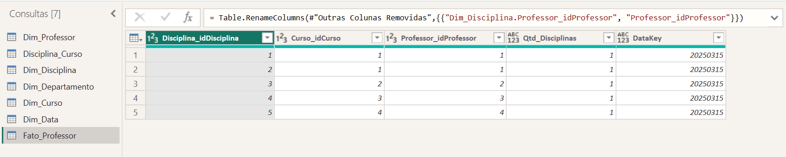
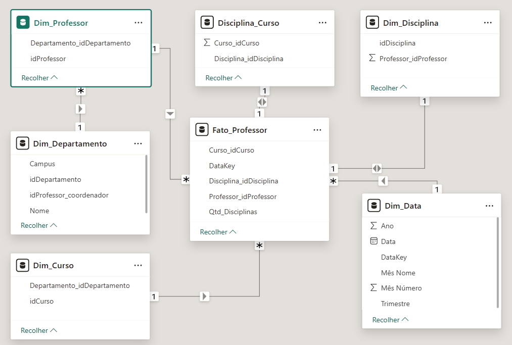

# Projeto: Construção de Star Schema para Cenários Universitários
### Bootcamp NTT DATA - Engenharia de Dados com Python (DIO)

Este repositório documenta a transformação de um modelo de banco de dados relacional (transacional) em um modelo dimensional (**Star Schema**), otimizado para análise de indicadores de professores e disciplinas em um ambiente universitário.

---

## 1. Objetivo do Desafio

O desafio consistiu em:

* Ignorar dados operacionais irrelevantes para este contexto (como dados de alunos e pré-requisitos).
* Estruturar uma Tabela Fato que consolide as métricas de ensino.
* Criar Dimensões que permitam filtrar essas métricas por Curso, Disciplina, Professor, Departamento e Tempo.

---

## 🛠️ 2. Infraestrutura: Banco de Dados Relacional (MySQL)

Para dar suporte ao projeto, os dados foram inicialmente estruturados e populados em um ambiente MySQL. Abaixo estão os scripts utilizados:

### 📜 Script 01: Criação das Tabelas (DDL)
```sql
-- =============================================
-- Modelo Relacional - Universidade (Transacional)
-- Baseado exatamente no diagrama EER do README
-- =============================================

CREATE SCHEMA IF NOT EXISTS universidade_star_schema;
USE universidade_star_schema;

-- 1. Departamento
CREATE TABLE Departamento (
    idDepartamento INT PRIMARY KEY AUTO_INCREMENT,
    Nome VARCHAR(45) NOT NULL,
    Campus VARCHAR(45) NOT NULL,
    idProfessor_coordenador INT
);

-- 2. Professor
CREATE TABLE Professor (
    idProfessor INT PRIMARY KEY AUTO_INCREMENT,
    Departamento_idDepartamento INT NOT NULL,
    CONSTRAINT fk_professor_departamento FOREIGN KEY (Departamento_idDepartamento) 
        REFERENCES Departamento(idDepartamento)
);

-- 3. Curso
CREATE TABLE Curso (
    idCurso INT PRIMARY KEY AUTO_INCREMENT,
    Departamento_idDepartamento INT NOT NULL,
    CONSTRAINT fk_curso_departamento FOREIGN KEY (Departamento_idDepartamento) 
        REFERENCES Departamento(idDepartamento)
);

-- 4. Disciplina
CREATE TABLE Disciplina (
    idDisciplina INT PRIMARY KEY AUTO_INCREMENT,
    Professor_idProfessor INT NOT NULL,
    CONSTRAINT fk_disciplina_professor FOREIGN KEY (Professor_idProfessor) 
        REFERENCES Professor(idProfessor)
);

-- 5. Disciplina_Curso (tabela associativa muitos-para-muitos)
CREATE TABLE Disciplina_Curso (
    Disciplina_idDisciplina INT NOT NULL,
    Curso_idCurso INT NOT NULL,
    PRIMARY KEY (Disciplina_idDisciplina, Curso_idCurso),
    CONSTRAINT fk_dc_disciplina FOREIGN KEY (Disciplina_idDisciplina) 
        REFERENCES Disciplina(idDisciplina),
    CONSTRAINT fk_dc_curso FOREIGN KEY (Curso_idCurso) 
        REFERENCES Curso(idCurso)
);

-- =============================================
-- Adiciona FK do coordenador (depois que Professor existe)
ALTER TABLE Departamento 
    ADD CONSTRAINT fk_departamento_coordenador 
    FOREIGN KEY (idProfessor_coordenador) REFERENCES Professor(idProfessor);
```

### 📜 Script 02: Inserção de Dados (DML)

```sql
-- Popula Departamento
INSERT INTO Departamento (Nome, Campus) VALUES 
('Engenharia de Computação', 'Campus São Paulo'),
('Ciência de Dados', 'Campus Rio de Janeiro'),
('Administração', 'Campus Belo Horizonte');

-- Popula Professor (depois dos departamentos)
INSERT INTO Professor (Departamento_idDepartamento) VALUES (1), (2), (1), (3);

-- Atualiza coordenadores
UPDATE Departamento SET idProfessor_coordenador = 1 WHERE idDepartamento = 1;
UPDATE Departamento SET idProfessor_coordenador = 2 WHERE idDepartamento = 2;
UPDATE Departamento SET idProfessor_coordenador = 4 WHERE idDepartamento = 3;

-- Popula Curso
INSERT INTO Curso (Departamento_idDepartamento) VALUES (1), (1), (2), (3);

-- Popula Disciplina
INSERT INTO Disciplina (Professor_idProfessor) VALUES (1), (1), (2), (3), (4);

-- Popula Disciplina_Curso (associa disciplinas aos cursos)
INSERT INTO Disciplina_Curso VALUES 
(1,1), (2,1), (3,2), (4,3), (5,4);
```

### 🟩 Validação

Abaixo, os comandos utilizados para validar a carga de dados e a integridade referencial antes da importação para o Power BI:

```mysql
SELECT * FROM Departamento;
SELECT * FROM Professor;
SELECT * FROM Curso;
SELECT * FROM Disciplina;
SELECT * FROM Disciplina_Curso;
```

<details>
<summary> ▶️ Saídas - Clique para expandir </summary>

Tabela Departamento;
```mysql
+----------------+----------------------------+-----------------------+-------------------------+
| idDepartamento | Nome                       | Campus                | idProfessor_coordenador |
+----------------+----------------------------+-----------------------+-------------------------+
|              1 | Engenharia de Computação   | Campus São Paulo      |                       1 |
|              2 | Ciência de Dados           | Campus Rio de Janeiro |                       2 |
|              3 | Administração              | Campus Belo Horizonte |                       4 |
+----------------+----------------------------+-----------------------+-------------------------+
```

</details>

```
mysql> SELECT * FROM Professor;
+-------------+-----------------------------+
| idProfessor | Departamento_idDepartamento |
+-------------+-----------------------------+
|           1 |                           1 |
|           3 |                           1 |
|           2 |                           2 |
|           4 |                           3 |
+-------------+-----------------------------+
4 rows in set (0,00 sec)

mysql> SELECT * FROM Curso;
+---------+-----------------------------+
| idCurso | Departamento_idDepartamento |
+---------+-----------------------------+
|       1 |                           1 |
|       2 |                           1 |
|       3 |                           2 |
|       4 |                           3 |
+---------+-----------------------------+
4 rows in set (0,00 sec)

mysql> SELECT * FROM Disciplina;
+--------------+-----------------------+
| idDisciplina | Professor_idProfessor |
+--------------+-----------------------+
|            1 |                     1 |
|            2 |                     1 |
|            3 |                     2 |
|            4 |                     3 |
|            5 |                     4 |
+--------------+-----------------------+
5 rows in set (0,00 sec)

mysql> SELECT * FROM Disciplina_Curso;
+-------------------------+---------------+
| Disciplina_idDisciplina | Curso_idCurso |
+-------------------------+---------------+
|                       1 |             1 |
|                       2 |             1 |
|                       3 |             2 |
|                       4 |             3 |
|                       5 |             4 |
+-------------------------+---------------+
5 rows in set (0,00 sec)
```

---

## ⚙️ 3. Processo de ETL (Power Query)

Após a importação dos dados para o Power BI, as seguintes transformações foram aplicadas no **Editor do Power Query**:

1.  **Limpeza e Renomeação:** Tabelas originais foram renomeadas para o prefixo `Dim_` (ex: `Dim_Professor`). Colunas desnecessárias foram removidas para otimizar a performance.
2.  **Criação da Dim_Data:** Como o banco original não possuía datas, foi criada uma dimensão temporal via Script M para permitir análises por ano, mês e trimestre:

    ```powerquery
    let
        DataInicio = #date(2025, 1, 1),
        DataFim = #date(2025, 12, 31),
        ListaDatas = List.Dates(DataInicio, Duration.Days(DataFim - DataInicio) + 1, #duration(1,0,0,0)),
        Tabela = Table.FromList(ListaDatas, Splitter.SplitByNothing(), {"Data"}),
        TipoData = Table.TransformColumnTypes(Tabela, {{"Data", type date}}),
        DataKey = Table.AddColumn(TipoData, "DataKey", each Date.Year([Data])*10000 + Date.Month([Data])*100 + Date.Day([Data]), Int64.Type)
    in
        DataKey
    ```
3.  **Construção da Fato_Professor:**
    * Foi utilizada a tabela `Disciplina_Curso` como base (Referência).
    * Foi aplicado o comando **Mesclar Consultas** para trazer o `Professor_idProfessor` da tabela de Disciplinas.
    * Foi adicionada uma **Coluna Personalizada** chamada `Qtd_Disciplinas` com valor fixo `1` (métrica de contagem).
    * Foi adicionada a coluna `DataKey` para relacionar com a dimensão calendário.

### Visão do Power Query Editor

- Organização das consultas dimensionais e aplicação das etapas de transformação (ETL) para limpeza e criação da tabela fato:

<p align="center">
  
</p>

---

## 📐 4. Arquitetura do Modelo (Star Schema)

O modelo final foi estruturado no formato **Snowflake/Star Schema** para garantir que o Departamento filtre o Professor e este, por sua vez, filtre a Fato.

### Relacionamentos:
* **Fato_Professor [1:N] Dim_Professor**: Via `Professor_idProfessor`.
* **Fato_Professor [1:N] Dim_Curso**: Via `Curso_idCurso`.
* **Fato_Professor [1:N] Dim_Disciplina**: Via `Disciplina_idDisciplina`.
* **Fato_Professor [1:N] Dim_Data**: Via `DataKey`.
* **Dim_Professor [1:N] Dim_Departamento**: Via `idDepartamento` (Configurando o braço Snowflake).

### Diagrama Star Schema (com ramificação Snowflake para Departamentos)

- Relacionamentos entre as tabelas de dimensão e a tabela fato centralizada no objeto Professor

<p align="center">
  
</p>

---

## 🚀 5. Conclusão
O modelo resultante permite uma análise granular da carga acadêmica. É possível visualizar, por exemplo, o total de disciplinas ofertadas por departamento em um período específico ou o volume de cursos atendidos por cada docente.

---
**Desenvolvido por:** Arthur Haerdy Junior  
**Contexto:** Desafio Módulo 8 - Bootcamp NTT DATA Python & Data Engineering.